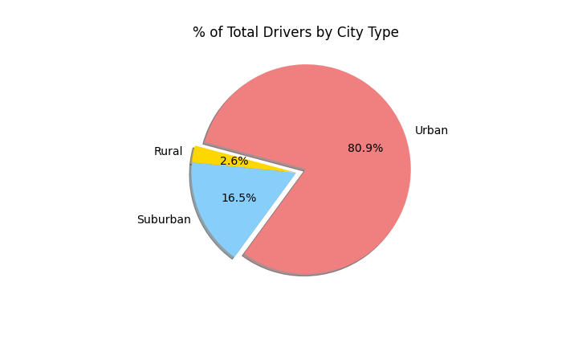
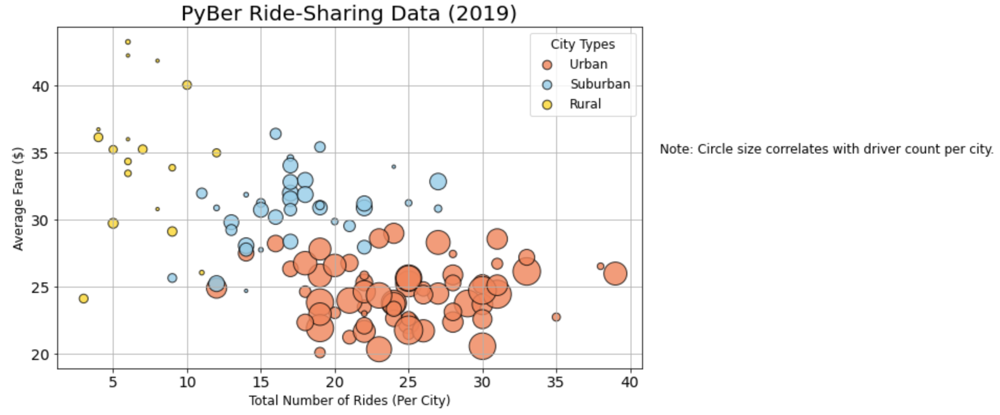
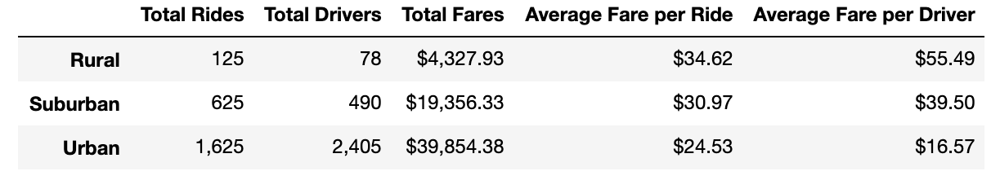
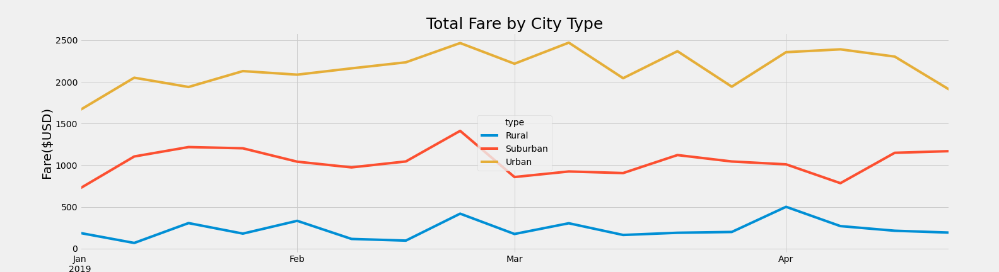

# **PyBer Analysis**

## **Project Overview:**

Pyber has giving us an assignment to create a summary of the ride sharing data by city type. Using our knowledge of Pandas and Matplotlib, we can map out the total weekly fares for each city type. To do this, we have to:
1. Read the City and Ride Data and store it into a single dataset
2. For each city type, count the total number of:
    * Rides
    * Drivers
    * Fares
3. For each city type, calculate the averages for:
    * Fare per ride
    * Fare per driver
4. Get the sum of fares for each week
5. Summarize business recommendations about the ride-shareing data

## Resources:
* Data Source: ride_data.csv, city_data.csv
* Software: Python 3.8.3, Matplotlib, Jupyer Lab, Visual Studio Code 1.46.0

## **Results:**

After collecting and organizing the total rides, driver, fares, averages of fares and drivers, and total fares by city, we were able to come to a few concolusions:

### **Total Rides**

As we can see, urban cities have **68.4%** most total rides, more than doubling the suburban cities **26.3%**, and towering over the rural cities **5.3%**.

### **Total Drivers**

The urban cities holds the majority with **80.9%** of the drivers, while the suburban cities **16.5%** and rural cities **2.6%** have a much smaller part of the business.

### **Total Fares**

Again, urban cities earn the highest with **62.7%**, suburban cities with **30.5%**, and rural cities with **6.8%**.

###  **Average fare per ride and Average fare per driver**

We were able to calculate the two averages to show us that:
* **Average fare per ride** is a lot lower in urban cities, dispite having more total rides. Suburban cites tend to have close similarity to their average fare to number of rides. Rural cities have the highest average fare with a lot lower number of rides.

* **Average fare per driver** is lower  urban cities, suburban cites have close similarity, and rural has a higher fare with lower about of drivers

### **Total fare by city type**

According to the data, the total for each city type is:
* **Urban:** Total fare of $39,854.38
* **Suburban:** Total fare of $19,356.33
* **Rural:** Total fare of $4,327.93

### **Total weekly fare by city type**

This is the total weekly fare of city types between the dates of **1/1/2019** and **4/28/2019**.

# **Summary**

After carefully analysing the dataframes and charts, we can make some upcomming predictions based off of the information we have currently been given.
1. Urban cities should increase the fare amount. 68.4% of our rides come from urban cities but the average fair per ride and driver are lower than other city types.

2. Suburban cities could hire more drivers. They make up 16.5% of the total drivers but almost half the total fares. More drivers would help keep up with the demand.

3. Rural cities should decrease the fare amount. The average fare per ride is the highest out of the city types. Making it a bit more affordable could cause the total rides to increase, thus increasing the total fare amount for rural cities.

 

